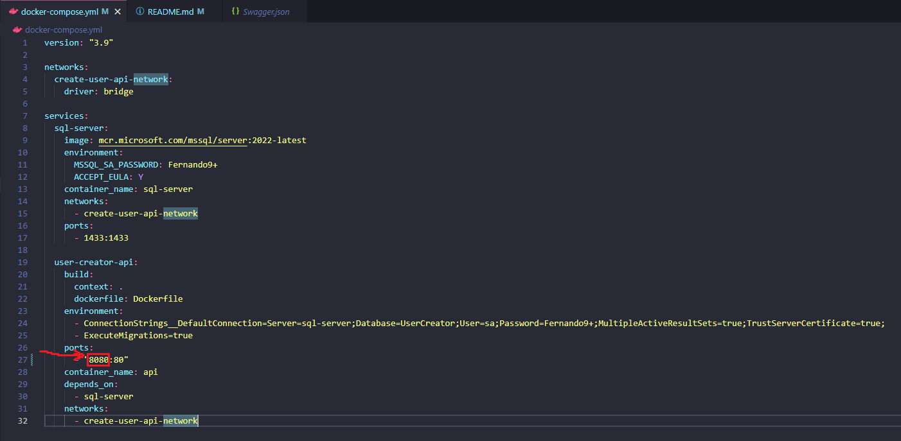

# UserCreator - Guia de Utilização

O UserCreator é um projeto destinado à criação e gerenciamento de usuários, oferecendo uma API robusta para essa finalidade. Este guia detalha as etapas para executar o projeto usando o Docker ou o Visual Studio, proporcionando uma experiência fluida desde o setup até o teste da API.

## Execução com Docker

Siga essas etapas para executar o projeto usando o Docker:

1. Navegue até a pasta raiz do projeto, onde você encontrará o arquivo docker-compose.yml.

2. Abra o terminal e execute o seguinte comando para iniciar os containers do Docker: "docker-compose up". Aguarde enquanto o Docker faz o download da imagem do SQL Server e constrói a imagem da API. Uma vez que os containers com as imagens especificadas no arquivo YAML estejam em execução, você poderá fazer solicitações para a URL http://localhost:80/api/User.
3. Uma coleção do Postman está disponível na pasta raiz do projeto para auxiliar no teste das requisições.
4. O arquivo YAML está configurado para mapear a porta da API dentro do container para a porta 8080 do host. Caso a porta 8080 esteja em uso, ajuste essa configuração no arquivo docker-compose.yml, na seguinte seção: 

5. Após a atualização da porta, se necessário, e a inicialização dos containers, certifique-se de atualizar as requisições do Postman para corresponder à porta configurada.

6. O arquivo Swagger.json está localizado na raiz do projeto. Para visualizar a documentação da API, recomendamos copiar o conteúdo do arquivo e utilizar o site https://editor.swagger.io/ para obter uma visualização interativa e realizar as requisições via Postman.

## Execução com Visual Studio

Para rodar o projeto diretamente no Visual Studio usando o IIS Express, siga essas etapas:

1. Abra a solução no Visual Studio.

2. No arquivo appsettings.development.json, altere a ConnectionString para apontar para o servidor do banco de dados SQL Server que você está usando.

3. Não é necessário criar as tabelas manualmente, pois as migrações estão configuradas para serem executadas automaticamente no início do projeto. Isso garante a criação do banco de dados e das tabelas necessárias.

4. Inicie o projeto no Visual Studio, e ele rodará usando o IIS Express.

Com essas instruções, você estará pronto para utilizar o UserCreator tanto através do Docker quanto do Visual Studio. Certifique-se de seguir os passos adequados ao seu ambiente de desenvolvimento preferido.